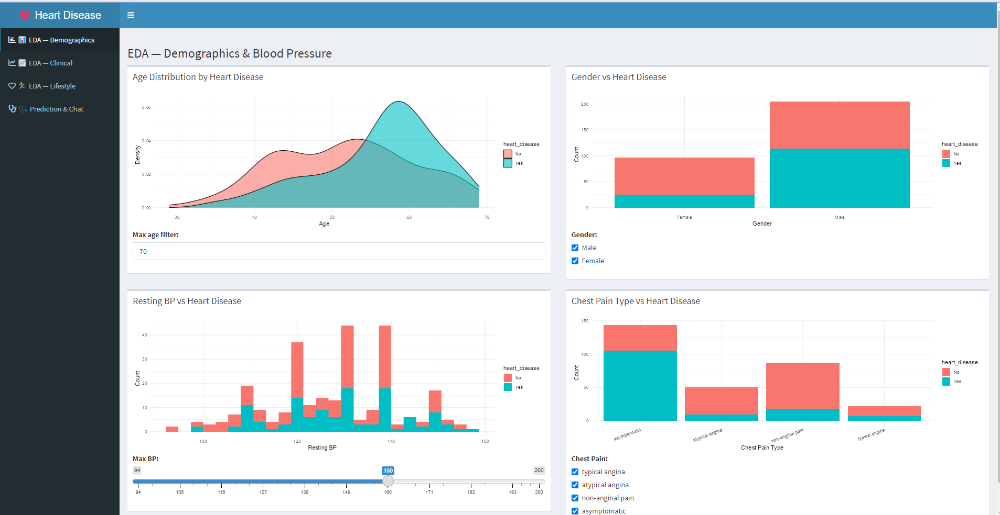
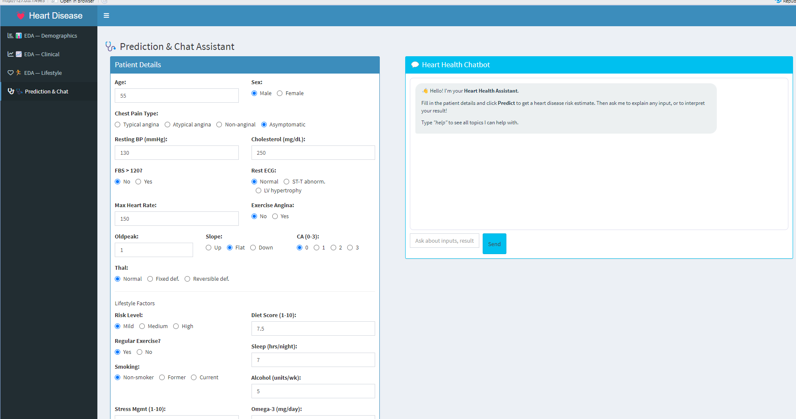
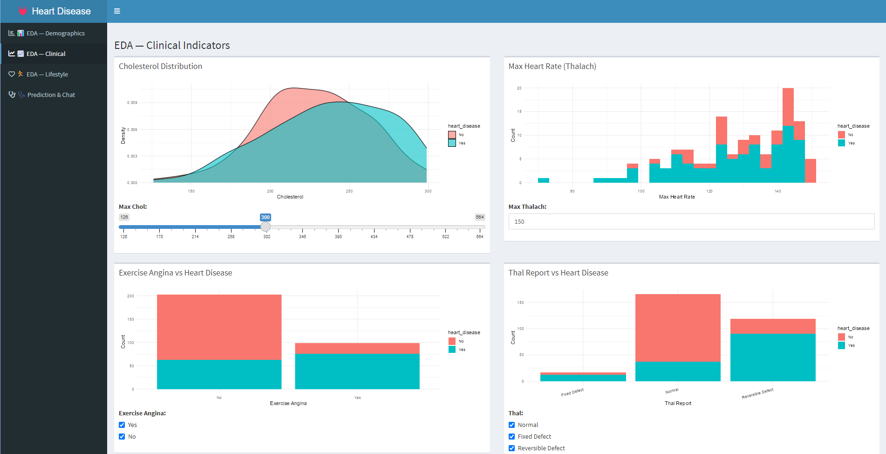
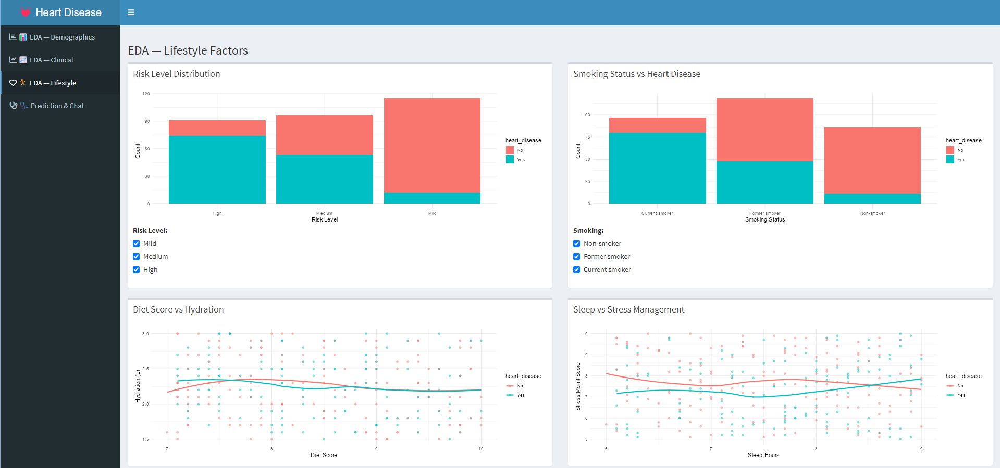

# 💓 Expert Heart Disease Prediction System — AI Chatbot
### *R + Shiny | Random Forest | Clinical ML | EDA Dashboard | Conversational AI*

[](https://www.r-project.org/)
[](https://shiny.posit.co/)
[](https://cran.r-project.org/package=randomForest)
[](https://archive.ics.uci.edu/ml/datasets/Heart+Disease)
[](https://opensource.org/licenses/GPL3)

---

## 📋 Table of Contents
- [Problem Statement](#-problem-statement)
- [Solution](#-solution)
- [Demo](#-demo)
- [Tech Stack](#-tech-stack)
- [Key Features](#-key-features)
- [Dataset](#-dataset)
- [Machine Learning Model](#-machine-learning-model)
- [Clinical Variables Explained](#-clinical-variables-explained)
- [EDA Dashboards](#-eda-dashboards)
- [Chatbot Capabilities](#-chatbot-capabilities)
- [Project Structure](#-project-structure)
- [How to Run](#-how-to-run)
- [Author](#-author)

---

## 🚨 Problem Statement

Cardiovascular disease is the **leading cause of death globally**, responsible for approximately 17.9 million deaths per year (WHO, 2021). Early and accurate risk assessment is critical, yet:

- 🏥 **Clinical assessments are time-consuming** — individual risk scoring requires multiple tests and specialist interpretation
- 📊 **Data is complex and multi-dimensional** — 13+ clinical and lifestyle variables interact in non-linear ways that human experts can miss
- 🌍 **Access to cardiology specialists is unequal** — rural and low-resource settings lack adequate cardiac risk screening
- 💊 **Silent disease is common** — many patients with heart disease have atypical or no symptoms until a cardiac event

A data-driven prediction system that combines **clinical biomarkers** with **lifestyle factors** can support earlier, more consistent risk identification — especially valuable in screening contexts.

---

## 💡 Solution

This app is a **full-stack R Shiny dashboard with an embedded AI chatbot** that:

1. Trains a **Random Forest classifier** on the UCI Cleveland Heart Disease dataset (303 patients, 13 clinical features)
2. Augments the dataset with **16 simulated lifestyle variables** (diet, exercise, smoking, sleep, stress etc.)
3. Provides **3 EDA dashboards** covering demographics, clinical indicators, and lifestyle factors
4. Accepts **patient input** across 30 clinical and lifestyle fields and outputs a **heart disease probability**
5. Runs a **conversational chatbot** that explains every input, interprets prediction results, and educates users on heart disease risk factors

The system bridges the gap between raw clinical data and actionable health understanding — making machine learning interpretable for both clinical and lay audiences.

---

## 🎬 Demo

| EDA Dashboard | Prediction & Chatbot |
|---------------|----------------------|
|  |  |

| Clinical EDA | Lifestyle EDA |
|-------------|---------------|
|  |  |

---

## 🛠️ Tech Stack

| Component | Technology | Purpose |
|-----------|-----------|---------|
| App Framework | R Shiny | Web application engine |
| UI Layout | shinydashboard | Sidebar + tab-based dashboard layout |
| ML Model | randomForest | Binary heart disease classification |
| Data Splitting | caTools | Stratified 70/30 train/test split |
| Visualisation | ggplot2 | All EDA charts and plots |
| Data Wrangling | dplyr | Data manipulation and summarisation |
| Chatbot Engine | Base R (reactive) | Rule-based medical question answering |
| Dataset | UCI Cleveland | 303 patients, 13 clinical variables |

---

## ✨ Key Features

### 📊 EDA Dashboards (3 Tabs)

**Tab 1 — Demographics & Blood Pressure**
- Age distribution by heart disease status (density plot)
- Gender vs heart disease (bar chart)
- Resting blood pressure distribution (histogram)
- Chest pain type vs heart disease (bar chart)
- Interactive filters: age cap, gender selector, BP range, chest pain type

**Tab 2 — Clinical Indicators**
- Cholesterol distribution (density plot)
- Maximum heart rate (Thalach) histogram
- Exercise-induced angina vs heart disease
- Thalassaemia type vs heart disease
- Interactive filters for each variable

**Tab 3 — Lifestyle Factors**
- Cardiovascular risk level distribution
- Smoking status vs heart disease
- Diet score vs hydration (scatter + LOESS)
- Sleep hours vs stress management score

### 🩺 Prediction Engine
- **30-variable patient input form** — 13 clinical + 16 lifestyle + age/sex
- **Random Forest probability output** with colour-coded risk level
- Instant prediction on button click with clinical advice
- Chatbot automatically announces and interprets the result

### 💬 AI Chatbot Advisor
- Explains all 13 clinical inputs in plain language
- Explains all lifestyle factors and their cardiac impact
- Interprets prediction results with personalised health advice
- Educates on heart disease science, risk factors, and prevention
- Covers the Random Forest model and dataset in plain English

---

## 📂 Dataset

**Source:** [UCI Machine Learning Repository — Heart Disease Dataset](https://archive.ics.uci.edu/ml/datasets/Heart+Disease)
**Origin:** Cleveland Clinic Foundation
**Patients:** 303 (after cleaning: 297 complete cases)
**Target Variable:** Presence (1) or absence (0) of heart disease

### Clinical Features (Original UCI)

| Variable | Description | Type |
|----------|-------------|------|
| `age` | Age in years | Numeric |
| `sex` | Sex (1=Male, 0=Female) | Binary |
| `cp` | Chest pain type (1=typical angina, 2=atypical, 3=non-anginal, 4=asymptomatic) | Categorical |
| `trestbps` | Resting blood pressure (mmHg) | Numeric |
| `chol` | Serum cholesterol (mg/dL) | Numeric |
| `fbs` | Fasting blood sugar > 120 mg/dL (1=Yes, 0=No) | Binary |
| `restecg` | Resting ECG result (0=Normal, 1=ST-T abnormality, 2=LV hypertrophy) | Categorical |
| `thalach` | Maximum heart rate achieved | Numeric |
| `exang` | Exercise-induced angina (1=Yes, 0=No) | Binary |
| `oldpeak` | ST depression induced by exercise relative to rest | Numeric |
| `slope` | Slope of peak exercise ST segment (1=Up, 2=Flat, 3=Down) | Categorical |
| `ca` | Number of major vessels coloured by fluoroscopy (0–3) | Categorical |
| `thal` | Thalassaemia type (3=Normal, 6=Fixed defect, 7=Reversible defect) | Categorical |

### Simulated Lifestyle Features (16 Variables)

| Variable | Description |
|----------|-------------|
| `Risk_Level` | Composite cardiovascular risk (1=High, 2=Medium, 3=Mild) |
| `Healthy_Diet_Score` | Dietary quality score (1–10) |
| `Regular_Physical_Activity` | Regular exercise (1=No, 2=Yes) |
| `Stress_Management_Score` | Stress coping score (1–10) |
| `Sleep_Hours` | Average nightly sleep (hours) |
| `Hydration_Liters` | Daily fluid intake (litres) |
| `Low_Impact_Exercise_Days` | Days/week of low-impact exercise (0–7) |
| `Fiber_Intake_grams` | Daily fibre intake (grams) |
| `Omega3_Intake_mg` | Daily omega-3 intake (mg) |
| `Weight_Management_Success` | Weight trend (1=Maintained, 2=Gained, 3=Lost) |
| `BP_Monitoring_Days` | Days/week of blood pressure monitoring |
| `Alcohol_Units_per_Week` | Weekly alcohol units |
| `Targeted_Nutritional_Score` | Nutrition programme score (1–10) |
| `Supervised_Activity_Minutes` | Supervised exercise minutes/week |
| `Smoking_Status` | Smoking status (1=Non-smoker, 2=Former, 3=Current) |
| `Symptom_Log_Days` | Days/week of symptom logging |
| `Emergency_Preparedness` | Emergency plan in place (1=No, 2=Yes) |

---

## 🤖 Machine Learning Model

### Algorithm: Random Forest

The app uses a **Random Forest** binary classifier (0 = No Heart Disease, 1 = Heart Disease).

```r
randomForest(y ~ ., data = train, ntree = default)
```

**Why Random Forest?**
- Handles non-linear interactions between clinical and lifestyle variables
- Robust to outliers (common in clinical data)
- Automatically handles mixed data types (numeric, categorical, factors)
- Provides variable importance — explainable output
- Resistant to overfitting via bagging (bootstrap aggregation)

**Training/Testing Split:**
- 70% training / 30% testing (stratified by target variable using `caTools::sample.split`)
- `set.seed(12)` for reproducibility

**Model Input:** All 30 features (13 clinical + 16 lifestyle + age/sex)
**Output:** Probability of heart disease (class "X1")

---

## 🔬 Clinical Variables Explained

<details>
<summary><b>Oldpeak (ST Depression)</b> — Click to expand</summary>

ST depression induced by exercise relative to rest. Values > 2.0 may indicate myocardial ischaemia. A value of 0 is normal. One of the strongest predictors in the model.
</details>

<details>
<summary><b>Thalach (Maximum Heart Rate)</b></summary>

Maximum heart rate achieved during exercise testing. Lower values relative to age indicate reduced cardiac reserve. Estimated max HR = 220 − age.
</details>

<details>
<summary><b>CA (Coronary Vessels)</b></summary>

Number of major coronary vessels coloured by fluoroscopy (0–3). Higher values indicate greater coronary artery disease burden.
</details>

<details>
<summary><b>Thal (Thalassaemia Type)</b></summary>

Nuclear stress test result: 3=Normal, 6=Fixed defect, 7=Reversible defect. Reversible defects are strongly associated with coronary artery disease.
</details>

---

## 💬 Chatbot Capabilities

The chatbot covers the following knowledge areas:

**Clinical Inputs**
```
"What is oldpeak?"          → ST depression explanation + clinical significance
"Explain thalach"           → Max heart rate and age formula
"What is IBH?"              → Inversion base height
"What does cp mean?"        → Chest pain type classification
"What is restecg?"          → ECG result interpretation
"Explain thal"              → Thalassaemia test results
"What is ca?"               → Coronary vessel fluoroscopy
"What is fbs?"              → Fasting blood sugar threshold
```

**Lifestyle Factors**
```
"Does smoking affect risk?" → Detailed smoking-heart disease link
"How does diet affect heart?" → Fibre, omega-3, Mediterranean diet evidence
"Sleep and heart disease"   → Sleep hours and cardiovascular risk
"Exercise and heart health" → 150 min/week guideline + benefits
"Stress and heart disease"  → Cortisol, inflammation, coping strategies
"Alcohol and heart risk"    → UK 14-unit guideline, effects of excess
```

**Prediction & Model**
```
"What does my result mean?" → Personalised risk level + advice
"How accurate is the model?" → Test accuracy and methodology
"How does Random Forest work?" → Ensemble explanation in plain English
"Tell me about the dataset" → Cleveland dataset background
```

---

## 📁 Project Structure

```
chatbot-heart-disease-prediction/
│
├── app.R                        # Complete Shiny app (UI + Server + Chatbot + ML)
├── processed_cleveland.csv      # UCI Cleveland dataset (with headers)
├── processed.cleveland.data     # UCI Cleveland raw data (no headers)
├── README.md                    # This file
└── screenshots/                 # App screenshots
    ├── eda_demographics.png
    ├── eda_clinical.png
    ├── eda_lifestyle.png
    └── prediction_chat.png
```

---

## 🚀 How to Run

### Prerequisites
- R (version 4.0 or higher)
- RStudio (recommended)

### Step 1: Install Required Packages

```r
install.packages(c(
  "shiny",
  "shinydashboard",
  "randomForest",
  "caTools",
  "ggplot2",
  "dplyr"
))
```

### Step 2: Clone or Download the Repository

```bash
git clone https://github.com/YourUsername/chatbot-heart-disease-prediction.git
cd chatbot-heart-disease-prediction
```

### Step 3: Run the App

```r
shiny::runApp("app.R")
```

> ⚠️ **Note:** The Random Forest model trains on first launch — this takes approximately 10–20 seconds. Subsequent interactions are instant.

### Step 4: Using the App

1. **EDA Tabs** — Explore demographics, clinical, and lifestyle charts. Use the interactive filters on each tab to drill down.
2. **Prediction Tab** — Enter patient details across all fields (defaults are pre-filled as a starting point)
3. Click **"Predict Heart Disease Status"**
4. View the colour-coded result below the form
5. Ask the chatbot: *"What does my result mean?"* for personalised guidance

---

## ⚠️ Disclaimer

This application is intended for **educational and research purposes only**. It is **not a medical diagnostic tool** and should not be used as a substitute for professional medical advice, diagnosis, or treatment. Always consult a qualified healthcare professional for medical decisions.

---

## 👤 Author

**Clinton Nakpodia**
📧 Nakpodiaclinton@gmail.com
🔗 [GitHub](https://github.com/nakpodia)
💼 [LinkedIn](https://linkedin.com/in/cnakpodia)

---

## 📄 License

This project is licensed under the MIT License. See [LICENSE](LICENSE) for details.

---

## 🙏 Acknowledgements

- **UCI Machine Learning Repository** — for the Cleveland Heart Disease dataset
- **randomForest R package** by Liaw & Wiener — for the core ML model
- **ggplot2** by Hadley Wickham — for the EDA visualisations
- **shinydashboard** by RStudio — for the dashboard layout
- Original Expert Heart Disease Prediction app concept — Clinton Data Science Portfolio
